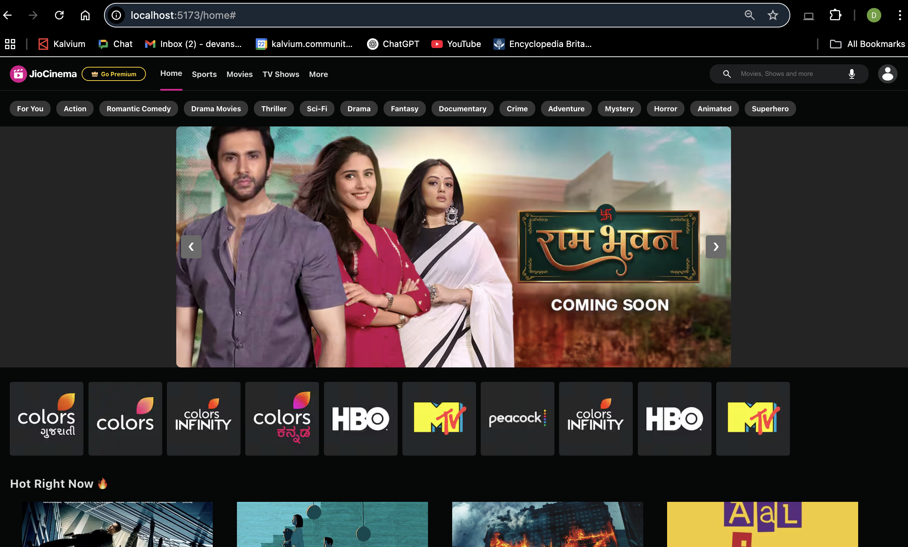
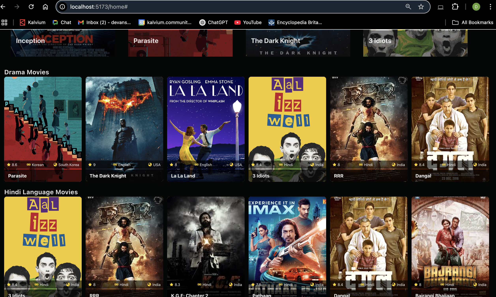
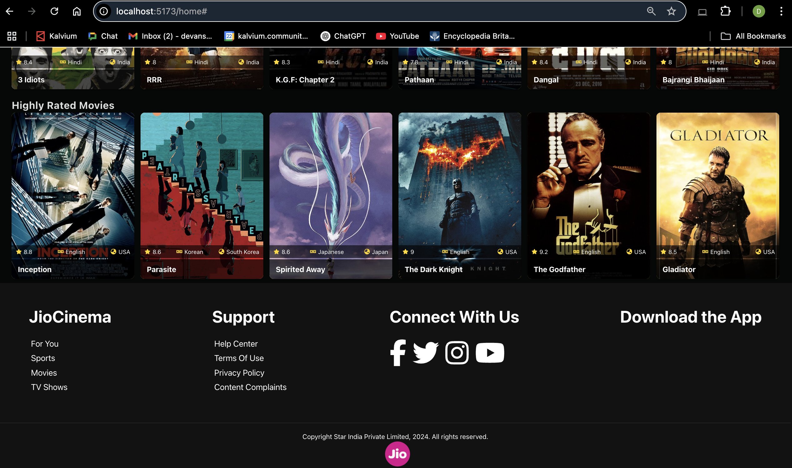

# JioCinema Clone - Using React 

A fully functional JioCinema clone built using **ReactJS**. This project replicates the UI and basic functionalities of the popular OTT platform, providing a seamless movie and TV show browsing experience.

---

## Features


### 1. **Search Functionality**
   - Search for your favorite movies or TV shows by their name.
   - Displays relevant results dynamically based on the search input.

### 2. **Carousel on Home Page**
   - A responsive and interactive carousel showcasing trending movies and TV shows.

### 3. **Multi-language Support**
   - Movies and TV shows are categorized based on languages, offering a diverse selection:
     - **Hindi**
     - **English**
     - **Gujarati**
     - **Kannada**
     - And more!

### 4. **Genre Filters**
   - Quickly browse movies and TV shows by genre, including:
     - Action
     - Romantic Comedy
     - Thriller
     - Sci-Fi
     - Drama
     - Fantasy
     - Documentary
     - And many others.

### 5. **Footer Section**
   - Includes links to:
     - Support pages (Help Center, Terms of Use, Privacy Policy).
     - Social media platforms for user engagement.
     - Option to download the JioCinema app.

---

## UI Screenshots

### Home Page



### Footer Section



---

## How to Run the Project

### Prerequisites
- Node.js installed on your system.
- Basic knowledge of ReactJS and web development.

### Steps to Run
1. Clone the repository:
   ```bash
   git clone https://github.com/your-username/jiocinema-clone.git

2. Navigate to the project directory.
3. Install all the dependencies.

3. Open your browser and go to http://localhost:5173/home.

---


## Contact

If you have any questions, suggestions, or want to contribute to this project, feel free to reach out:

- **Email**: [devanshsingh1974@gmail.com](mailto:your-email@example.com)  
- **GitHub**: [devansh1974](https://github.com/your-github-username)  
- **LinkedIn**: [devanshsingh2006](https://www.linkedin.com/in/your-linkedin-profile/)  

---

## Acknowledgements

- Inspired by the **JioCinema** platform.  
- Thanks to all contributors and open-source libraries used in this project.  

---

## License

This project is licensed under the [MIT License](LICENSE). You’re free to use, modify, and distribute it as per the terms of the license.
